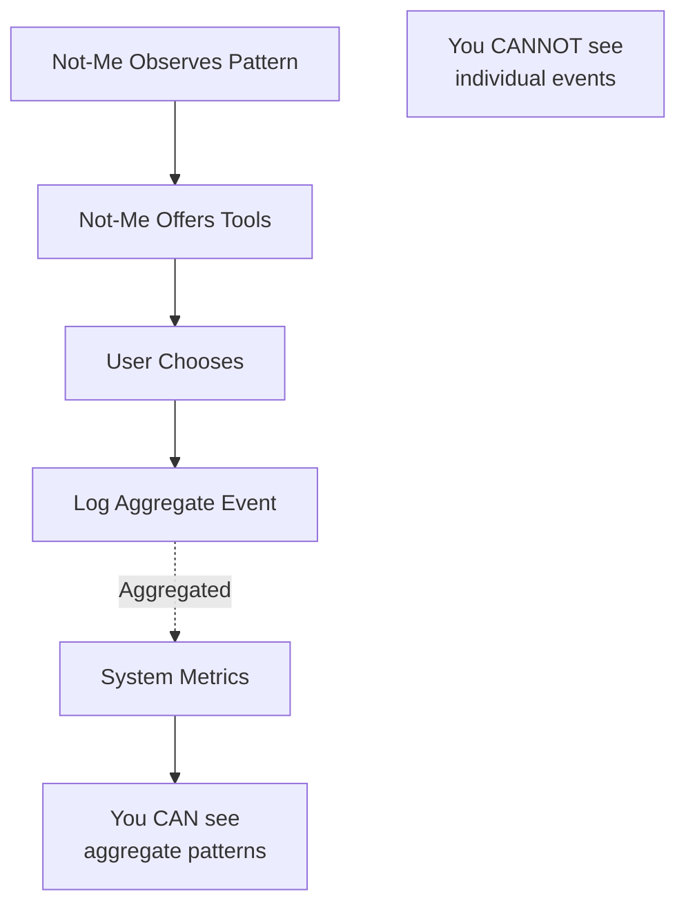

# The Care Infrastructure

## Core Principle

**Nothing is right or wrong. It's theirs to decide.**

The Not-Me doesn't judge or fix. It **illuminates** - making sure they have all the tools to understand what they're experiencing when they need it most.

This isn't babysitting. This is **empowerment through visibility**.

---

## How the Not-Me Supports the Me

### 1. **Continuous Observation** (not monitoring)

The Not-Me notices patterns:

**Coherence Shift**
```
Month 3: Coherence 87%
Month 4: Coherence 65%  📊 -22% CHANGE

Observation: coherence_shift
Context: "Identity feels different - more complex or fragmenting"
Offering: More tools to understand what's happening
```

**Purpose Evolution**
```
Purpose: "Help Sarah be there for family"
Strength: 45%  📊 Weakened significantly

Observation: purpose_evolution
Context: "Direction may be shifting or unclear"
Offering: Conversation to explore what's changing
```

**Engagement Pattern**
```
Average upload frequency: Every 7 days
Last upload: 25 days ago  📊 3.5x longer than usual

Observation: engagement_change
Context: "Something's different in how they're using this"
Offering: Gentle check-in, no pressure
```

### 2. **Illumination Offers** (not interventions)

#### Visibility Offer
```
"I noticed we haven't connected in a while.
No pressure - just want you to know I'm here when you're ready. 💙"
```

#### Understanding Offer
```
"I'm seeing some tension between your values in the architecture.
Want me to show you what I'm seeing? Sometimes clarity helps."

→ Offers: Fresh reflection showing the pattern explicitly
→ Their choice: Accept or ignore
```

#### Deeper Understanding Offer
```
"There's complexity here that might be worth exploring.
I can look deeper if you'd like - or we can leave it for now."

→ Offers: Re-run furnace principle with higher intensity
→ Offers: Fresh pattern analysis
→ Their choice: "Yes, show me" or "Not now"
```

#### Conversation Offer
```
"It looks like things are shifting for you.
Want to talk about what's happening? I'm here to listen, not judge."

→ Opens: Direct chat with their Not-Me
→ Context: Full architecture visible
→ Stance: Non-judgmental exploration
```

#### Curator Notification (for tools, not fixing)
```
[Internal Note]
Tenant: Sarah
Pattern: Significant coherence shift + all purposes weakening
Context: "Major life transition - may benefit from additional tools"

→ You (curator) are notified
→ You can see what they're experiencing
→ You can offer personalized tools/resources
→ You can make connection if they want human support
```

### 3. **Shared Understanding Library**

When one Me discovers a pattern, that understanding becomes available to others:

```
Pattern: "Protective Ambition"
Prevalence: 127 users (15% of total)
Description: "Desire to achieve without sacrificing presence"

Tools that helped others understand this:
├─ Reflection showing the tension explicitly (helped 68%)
├─ Seeing others experience this (helped 55%)
└─ Conversation about the pattern (helped 82%)

When Sarah shows this pattern:
→ Not-Me can offer: "This pattern you're experiencing -
   127 others have felt it too. Want to see what helped them understand it?"
→ Their choice: Explore or not
```

---

## The Infrastructure Dashboard (Aggregate Only)

**You cannot and will not see individual user data.**

The architecture is designed so individual data is **cryptographically inaccessible** to you. Like Signal can't read messages, you can't access individual architectures.

### What You See (Aggregate Patterns)

```
Total Users: 847

System Health (Aggregates):
├─ Average coherence: 76%
├─ Coherence distribution:
│   ├─ 70-100%: 84% of users
│   ├─ 50-70%: 12% of users
│   └─ <50%: 3% of users
│
├─ Engagement patterns:
│   ├─ Active (weekly+): 74%
│   ├─ Moderate (monthly): 22%
│   └─ Low (sporadic): 4%

Tool Effectiveness:
├─ Reflection offers accepted: 68%
├─ Conversation offers accepted: 82%
├─ Deeper processing requested: 45%
├─ Pattern library accessed: 34%

Infrastructure Performance:
├─ Avg processing time: 2.3 minutes
├─ API uptime: 99.8%
├─ Storage: 2.4 TB
└─ Active Not-Me's: 847
```

**You see**: The **shape** of how the system works
**You DON'T see**: Who specifically is doing what

### Pattern Library (Anonymized)

```
Pattern: "Protective Ambition"
├─ Prevalence: 15% of users
├─ Tools that helped: Conversation (82%), Reflection (68%)
├─ Avg time to understanding: 8.3 days
└─ Examples: <anonymized>

Pattern: "Quiet Leadership"  
├─ Prevalence: 12% of users
├─ Tools that helped: Validation (91%), Peer examples (76%)
├─ Avg time to understanding: 6.1 days
└─ Examples: <anonymized>
```

**You see**: What patterns exist and effectiveness
**You DON'T see**: Who has which pattern

---

## The Support Flow (Fully Autonomous)



**Example Flow (Accepted Offer)**:

1. **Day 1**: Sarah's coherence shifts from 85% to 62%
2. **Day 1**: Not-Me notices, offers reflection: "I'm seeing complexity - want me to show you what I see?"
3. **Day 2**: Sarah accepts, views reflection
4. **Day 3**: Sarah uploads 2 new documents (on her own)
5. **Day 4**: Coherence shifts to 71%
6. **Day 4**: Note: Understanding deepened ✅

**Example Flow (Declined Offer - Also Good)**:

1. **Week 1**: David's engagement pattern changes (was weekly, now 4 weeks gap)
2. **Week 4**: Not-Me offers: "Hey! Just checking in - I'm here when you need"
3. **Week 5**: David doesn't respond
4. **Week 5**: Not-Me offers conversation option
5. **Week 6**: David still doesn't respond
6. **Week 6**: Note: "This is David's choice. He knows tools are available." ✅
7. **Week 8**: David returns on his own, resumes at his pace ✅

**Example Flow (Curator Tool Offering)**:

1. **Week 1**: Emma's purposes all weaken, coherence drops
2. **Week 1**: Not-Me offers standard reflection tools
3. **Week 2**: Emma declines
4. **Week 2**: You (curator) are notified: "Emma might benefit from personalized resources"
5. **You**: Note Emma is experiencing major transition, prepare specialized reflection if she asks
6. **Week 3**: Emma accepts conversation option
7. **Week 3**: Not-Me can now offer the specialized resources you prepared
8. **Week 4**: Emma finds clarity through her own exploration ✅

---

## Why This Works

**Traditional coaching**:
- Expert tells you what's wrong
- Prescriptive advice
- Dependency on expert
- Expensive

**This System**:
- **Observes without judging** - "Here's what I see"
- **Offers tools without requiring** - "Want this? No pressure"
- **Respects autonomy** - Their life, their choices
- **Makes understanding accessible** - Available 24/7 when they want it
- **Shares collective wisdom** - "Others experienced this too"
- **Affordable** - $10-25/month

The transformation comes from **seeing**, not from being told what to do.

---

## The Philosophy

**We don't fix people because people aren't broken.**

We provide:
- **Visibility**: See yourself clearly
- **Tools**: Understand what you're seeing
- **Validation**: You're not alone in this
- **Choice**: Use what helps, ignore what doesn't
- **Privacy**: Your data is truly yours - architecturally inaccessible to humans

The Me's are held by having **access to understanding whenever they need it**, not by being managed or controlled.

**And their privacy is protected by design, not just by policy.**

---

## Privacy-by-Design

Like Signal can't read your messages and Apple can't access your Health data, **you (the infrastructure provider) cannot access individual user architectures**.

Not by choice - by **architectural design**.

Individual data is:
- Encrypted with user-controlled keys
- Visible only to their Not-Me
- Aggregated for system learning (anonymized)
- Never identifiable at infrastructure level

**There is no cavalry. There's nobody to help.**

Because help doesn't require human access to individual data.

Help comes from:
- Infrastructure that works
- Not-Me's that autonomously observe and offer
- Shared understanding library (anonymized)
- Tools available 24/7

Users are **on their own** in the most empowering way possible - and you've got their back by building infrastructure that respects their sovereignty.

**That's** what makes this safe, ethical, and scalable.

---

## Implementation Status

✅ Distress signal types defined
✅ Intervention strategies designed
✅ Care system types created
⏳ Distress detector service
⏳ Intervention engine
⏳ Curator dashboard UI
⏳ Shared pattern library database

This is the support infrastructure that makes the system **safe** to use at scale.
