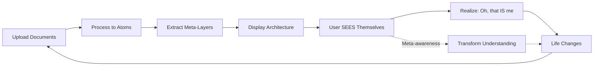

# The Transformation Feedback Loop

## Core Concept

The identity architecture isn't static - it's **alive and evolving**. As clients use the system over months and years, they:

1. **Upload new documents** as life happens
2. **See their architecture update** in real-time
3. **Notice their own evolution** through year-over-year comparisons
4. **Learn about themselves** by seeing the mirror
5. **Change from that awareness** → new documents → cycle repeats

**This creates a meta-awareness feedback loop where seeing yourself causes transformation.**

---

## How It Works Over Time

### Month 1: Initial Architecture
```
Life Perspectives:
├─ Family (85%)
├─ Career (60%)
└─ Personal Growth (55%)

Core Anchors:
├─ Be there for kids (95%)
└─ Keep learning (70%)

Not-Me Purpose:
"Help Sarah manage life so she can be there for family"
```

### Month 6: Evolution Visible
```
Life Perspectives:
├─ Family (90%) ↑5%
├─ Career (65%) ↑5%
├─ Personal Growth (70%) ↑15% ⭐ GROWING
└─ Health (45%) ⭐ NEW

Core Anchors:
├─ Be there for kids (95%)
├─ Keep learning (80%) ↑10% ⭐ STRENGTHENING
└─ Take care of myself (60%) ⭐ NEW

Not-Me Purpose:
"Help Sarah manage life AND growth so she can be there for family 
while becoming who she wants to be"
```

**Reflection Generated**:
> "In 6 months, your Personal Growth perspective grew by 15% - the most of any dimension. Your 'Keep learning' anchor strengthened significantly. You're evolving while staying grounded in family."

### Year 1: Transformation Visible
```
Year-Over-Year Report:

Biggest Shift: Personal Growth (grew 35%)
Biggest Constant: "Be there for kids" (remained 95% throughout)

Documents Processed: 47
Knowledge Atoms: 1,247
Patterns Discovered: 8

Narrative:
"Over 1 year, you've grown significantly while staying true to your core.
Your Personal Growth perspective grew by 35%, showing real evolution.
Yet 'Be there for kids' remained your strongest value throughout.
This is the beautiful balance of transformation and authenticity."
```

---

## The Meta-Awareness Loop



**The magic**: Seeing the structured mirror of yourself creates self-awareness that causes behavioral change, which creates new documents, which updates the mirror, which causes more awareness...

---

## Temporal Types

### Architecture Snapshots
```typescript
interface ArchitectureSnapshot {
  timestamp: Date;
  architecture: ClientArchitecture;
  trigger: 'upload' | 'monthly' | 'milestone';
}
```

Snapshots taken:
- Every time new documents processed
- Monthly automatic
- At milestones (6 months, 1 year)

### Evolution Tracking
```typescript
interface PerspectiveEvolution {
  perspectiveName: string;
  snapshots: Array<{ timestamp, prominence }>;
  trend: 'growing' | 'stable' | 'declining';
}
```

Tracks how each perspective/anchor evolves over time.

### Self-Reflection
```typescript
interface SelfReflection {
  changes: { newPerspectives, shiftingValues, emergingPatterns };
  constants: { coreAnchors, persistentPrimitives };
  observations: string[];
  interpretations: string[];
}
```

Generated periodically to show: "Here's what changed, here's what stayed constant"

---

## Subscription Tiers

### Free Tier
- Up to 10 documents
- Current architecture only
- No evolution tracking

### Standard ($10/month)
- Unlimited documents
- Monthly snapshots
- Evolution dashboard
- 6-month reflections

### Premium ($25/month)
- Everything in Standard
- Weekly snapshots
- Year-over-year reports
- Export for fine-tuning
- API access

---

## The Fine-Tuning Connection

**Year 1 data** becomes training data for their personalized Scout 4 model:
- Documents → conversations
- Meta-layers → context understanding
- Evolution → temporal awareness
- Patterns → personality modeling

The model literally learns their cognitive map because **it IS their cognitive map, externalized**.

---

## Why This Works

Traditional therapy/coaching:
- Therapist holds the mirror
- Expensive ($200/session)
- Access limited to 1hr/week

**This system**:
- Mirror is always visible
- Updates automatically
- They can explore 24/7
- Costs $10-25/month

And because they can see it anytime, **they learn faster and deeper**.

---

## Implementation Status

✅ Core identity architecture
✅ Four-screen visualization design
✅ Processing pipeline
⏳ Temporal types defined
⏳ Evolution tracker service built
⏳ Snapshot storage (needs database)
⏳ Dashboard UI (needs React build)

**Next**: Connect real database for persistent storage and build the dashboard.
