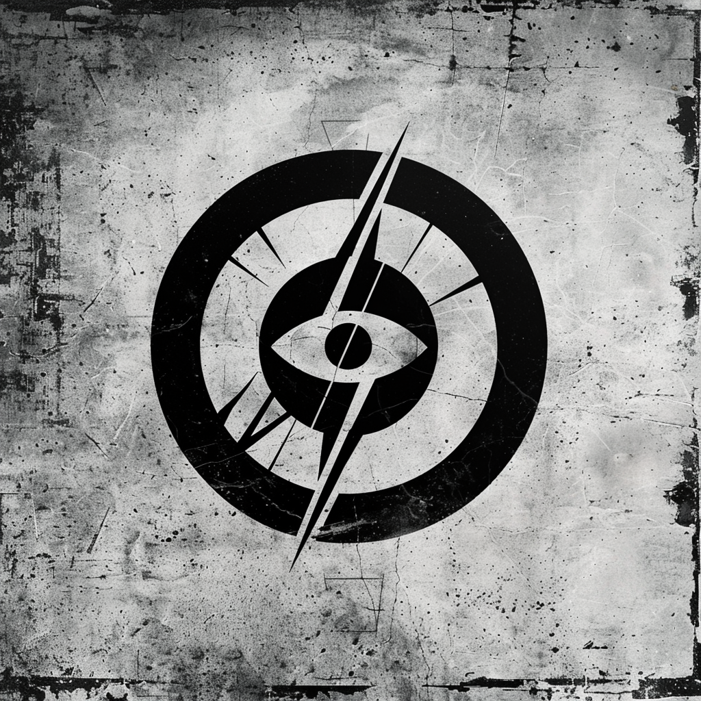

# Credential Atlas

**credential-atlas.ai**

---

## ONE Identity

The seer.

---

## ONE Offer

We see what others can't.

Credentials → Institutions → Outcomes.
The Intelligence Layer that maps the truth.

---

## ONE Customer

Those who need to see clearly.

---

## ONE Path

You come to us when you're lost in the credential maze.
We show you the map.

---

## ONE Tagline

**One Truth.**

---

## Visual Identity

### The Mark

**The bolt SEES.**

This is the precision instrument. The navigator. A double-ringed circle containing an eye at center. A bolt runs diagonally through like a compass needle. Small directional points radiate from the eye.

| Element | Description |
|---------|-------------|
| Circle | Double ring — layers of verification, institutional trust |
| Eye | Central — the pupil, the focus, the seeing |
| Bolt | Diagonal needle — piercing through, navigation tool |
| Points | Compass rays — direction, mapping |
| Texture | Light (15%) — cleanest, most precise |

### What It Means
The bolt from Primitive Engine arrives here transformed into a tool. It has become a needle for navigation, a compass for direction. The eye at center says: we find what others miss. Perception is ACTIVE, not passive. This is where the bolt learns to see.

### The Bolt's Journey
**Stage 3 of 4: SEES**

### Color Accent
Steel Blue — `#4A6FA5`
Precision, trust, clear sight, analytical clarity.

### Files
- `credential_atlas.png` — Raster with texture ✓
- `credential_atlas.eps` — Vector clean (Ivan in progress)

---

## Domains

| Domain | Role |
|--------|------|
| credential-atlas.ai | Primary |
| credentialatlas.com | → Redirect |
| credential-atlas.com | → Redirect |
