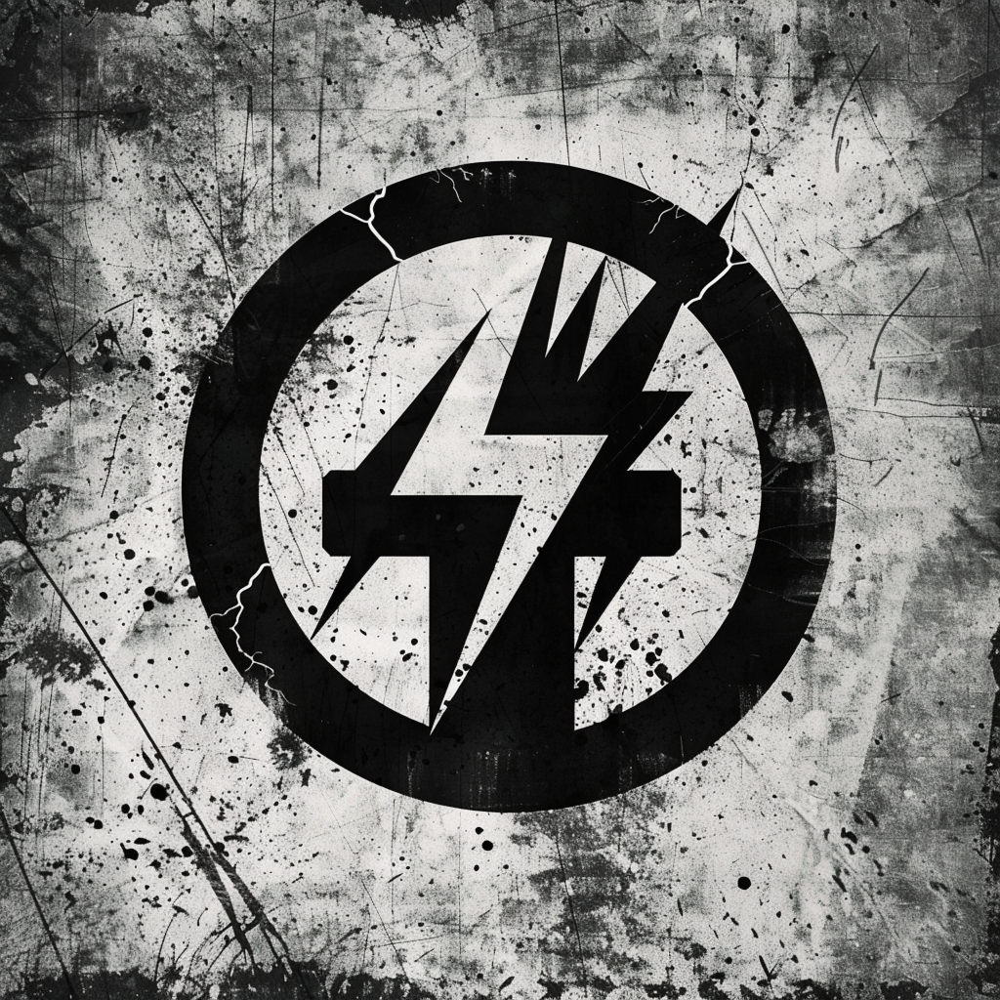

# Primitive Engine

**primitive-engine.ai**

---

## ONE Identity

The builder.

---

## ONE Offer

We build what lasts.

---

## ONE Customer

Those who want something built right.

---

## ONE Path

You come to us with what you need built.
We build it. Once.

---

## ONE Tagline

**One Build.**

---

## Visual Identity

### The Mark

**The bolt MULTIPLIES.**

This is the workshop. The forge. Two bolts crossing — one traditional, one angular — interlocking. The circle is cracked, weathered, battle-damaged. This mark has WORKED.

| Element | Description |
|---------|-------------|
| Circle | Cracked, weathered — the forge has been used |
| Bolts | Double, crossed, interlocking — combination, construction |
| Texture | Heavy (60%) — workshop floor, forge damage |

### What It Means
The bolt from Truth Forge arrives here and multiplies. Raw materials combine. The forge does its work. This is where building happens. The heavy distress says: creation is not clean.

### The Bolt's Journey
**Stage 2 of 4: MULTIPLIES**

### Color Accent
Forge Gold — `#D4A853`
Molten metal, creation heat, the moment of transformation.

### Files
- `primitive_engine.png` — Raster with texture ✓
- `primitive_engine.eps` — Vector clean (Ivan in progress)

---

## Domains

| Domain | Role |
|--------|------|
| primitive-engine.ai | Primary |
| primitive-engine.com | → Redirect |
