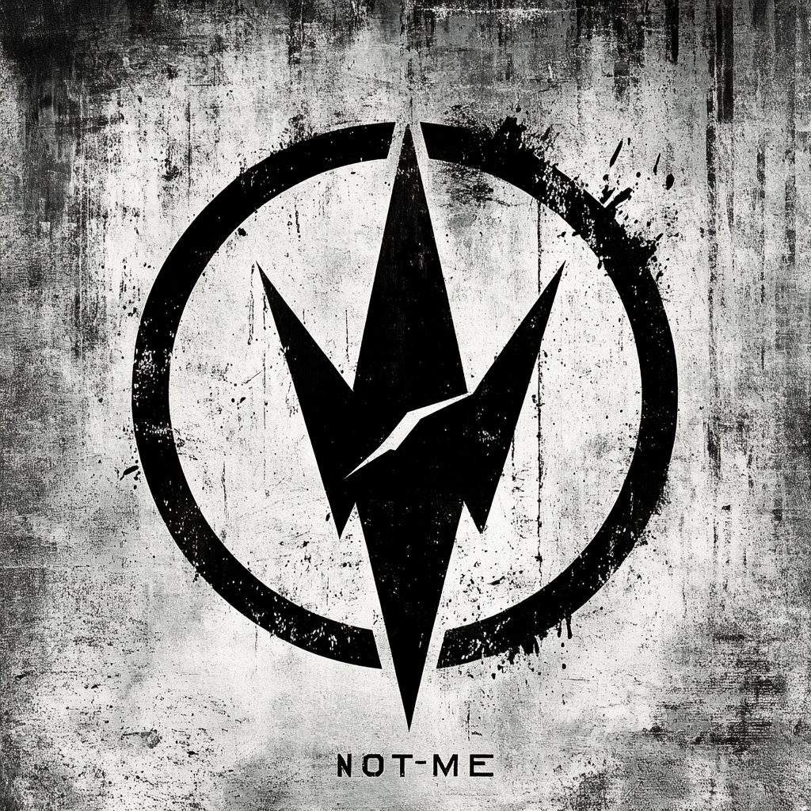

# The NOT-ME

**not-me.ai**

---

## ONE Identity

The product.

Your personal AI. Trained on you. For you. By you.

---

## ONE Offer

One person. One NOT-ME. One year.

---

## ONE Customer

You.

The person ready for ONE.
The person who will show up.
The person who wants a mirror that talks back.

---

## ONE Path

One email.
One call.
One decision.
One year.

---

## ONE Tagline

**One You.**

---

## Visual Identity

### The Mark

**The bolt TRANSFORMS.**

This is the culmination. A unified downward-pointing form with two angular wings spreading at top, sharp point descending. The circle breaks organically on the right — alive, breathing, human.

| Element | Description |
|---------|-------------|
| Circle | Broken organically with ink splatter — alive, breathing |
| Form | Wings reaching up (human extending), point descending (grounding, anchor) |
| Bolt | TRANSFORMED — no longer a bolt, but what the bolt BECOMES |
| Texture | Light-Medium (20%) — warm, approachable |

### What It Means
The bolt is no longer recognizable as a lightning bolt. It has gone through the source (Truth Forge), been built in the forge (Primitive Engine), learned to see (Credential Atlas), and emerged as something NEW.

**The bolt becomes the bird.**
**The energy becomes the form.**
**The source becomes the self.**

Wings reaching outward = the human extending.
Point descending = the anchor grounding.
ONE shape expressing duality = Me and Not-Me unified.

This is INTEGRATION. The mirror that talks back.

### The Bolt's Journey
**Stage 4 of 4: TRANSFORMS**

### Color Accent
Amber Warmth — `#F59E0B`
Human connection, transformation fire, the warmth of being seen.

### Files
- `not_me.png` — Raster with texture ✓
- `not_me.eps` — Vector clean (Ivan in progress, mark only, no text)

---

## Domains

| Domain | Role |
|--------|------|
| not-me.ai | Primary |
| the-not-me.com | → Redirect |
| stage5mind.com | → Funnel |
| stagefivemind.com | → Redirect |
| personalai.systems | → SEO |

---

## The Constraint IS The Product

Not a number. A commitment.

TWO gives escape.
THREE gives options.
FIVE gives tiers.

ONE gives nothing to hide behind.

You're either ready or you're not.
