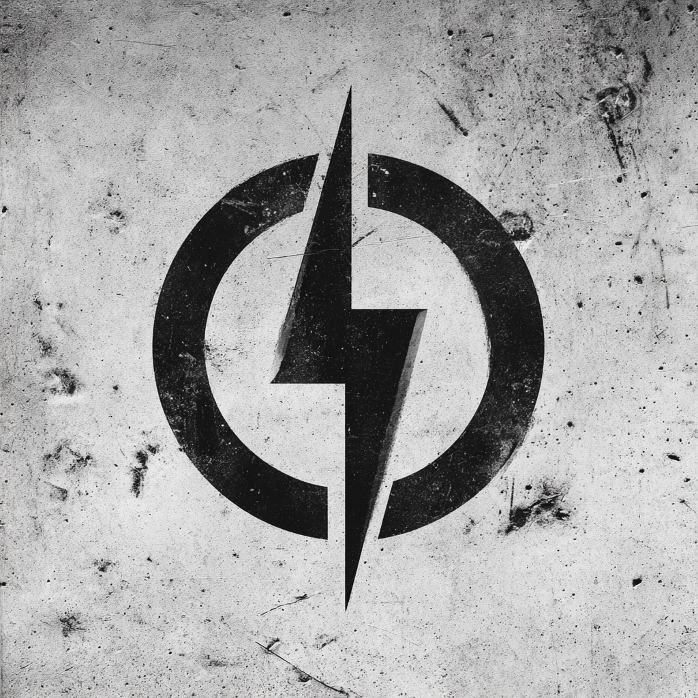

# Truth Forge

**truth-forge.ai**

---

## ONE Identity

The source.

---

## ONE Offer

We hold what we build.

---

## ONE Customer

Those who want to understand the whole.

---

## ONE Path

You don't buy from Truth Forge.
You discover Truth Forge is behind what you already bought.

---

## ONE Tagline

**One Source.**

---

## Visual Identity

### The Mark

**The bolt EXISTS.**

This is the origin. The bolt in its purest form — single, vertical, piercing through. Everything else derives from this.

| Element | Description |
|---------|-------------|
| Circle | Broken at top and bottom — the bolt cannot be contained |
| Bolt | Single, vertical, piercing through center — the origin strike |
| Texture | Medium (30%) — authoritative, has lived |

### What It Means
The bolt breaks the circle. It came from somewhere else and goes somewhere else. The circle merely holds it momentarily. This is transcendence. This is the source from which Primitive Engine builds, Credential Atlas sees, and NOT-ME transforms.

### The Bolt's Journey
**Stage 1 of 4: EXISTS**

### Color Accent
Source White — `#F5F0E6`
Illumination, origin, the light from which others derive.

### Files
- `truth_forge.png` — Raster with texture ✓
- `truth_forge.eps` — Vector clean ✓

---

## Domains

| Domain | Role |
|--------|------|
| truth-forge.ai | Primary |
| truth-forge.com | → Redirect |
